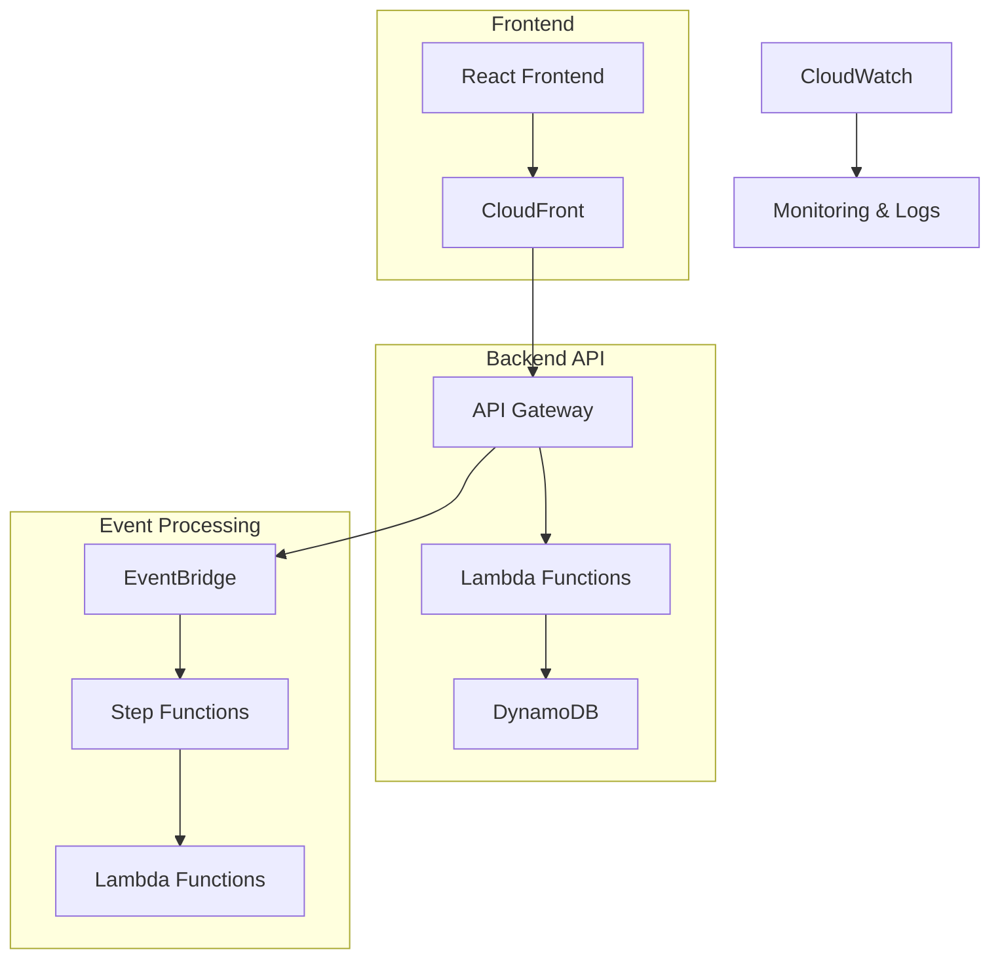
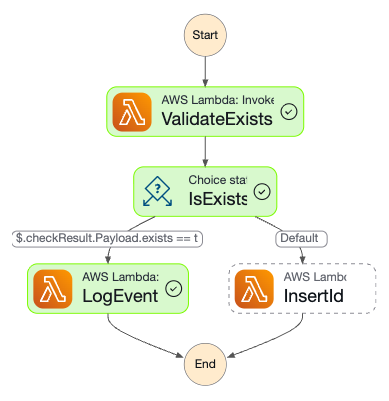
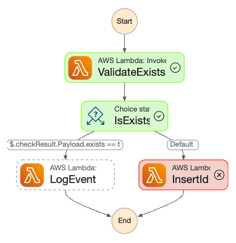

# Cloud Software Engineer - Home Assignment

A full-stack, event-driven cloud-native application for managing customer IDs using AWS serverless services.

## 🏗️ Architecture Diagram



## 📚 API Documentation

**Postman Documentation**: https://documenter.getpostman.com/view/14803778/2sB3Hrkx1r

## 🛠️ Setup Frontend App Instructions

### Prerequisites
- Node.js (v16+) and npm
- AWS CLI configured (for testing API directly)

### Frontend Setup
```bash
cd cloudzone

# Install dependencies
npm install

# Set environment variables
cp .env.local
# set REACT_APP_API_BASE_URL and REACT_APP_API_KEY in the .env.local file

# Run locally
npm start

# Build for production
npm run build
```

### Environment Variables (.env)
```
REACT_APP_API_BASE_URL=https://t40dks3sjc.execute-api.eu-west-1.amazonaws.com/dev
REACT_APP_API_KEY=RTVpwPCwWQ8jcyzqJLKTD5KZOKamFJal2GpnzogJ
```

## 🧪 Testing Instructions

### Frontend Testing
1. Open the CloudFront URL in your browser
2. Test all three operations:
   - Add a customer ID
   - Check if ID exists  
   - Delete a customer ID

### Step Functions Testing
1. Navigate to the Step Function execution history URL above
2. Trigger a new execution by adding a customer ID via the API
3. Monitor the workflow execution and logs

## Example Executions

Successful execution:


Failed execution:


## 🔗 AWS Environment Access

- **CloudFront (React App)**: https://d2vgfjuqs9k9r1.cloudfront.net/
- **API Gateway (REST API)**: https://eu-west-1.console.aws.amazon.com/apigateway/main/apis/t40dks3sjc/resources?api=t40dks3sjc&region=eu-west-1
- **Step Function Execution History**: https://eu-west-1.console.aws.amazon.com/states/home?region=eu-west-1#/statemachines/view/arn%3Aaws%3Astates%3Aeu-west-1%3A138008497640%3AstateMachine%3AMyStateMachine-5ebb54e1?type=standard
